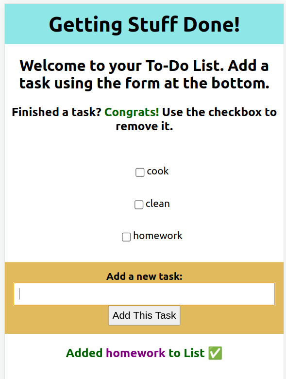

# To Do List - A One Page React App

Allows the user to add to their personal to-do list, removing with a check-box = "done!" Need to leave and come back? No problem, the app will remember your tasks!

Created using React Frameworks, HTML5, CSS.

## How To View App

On Netlify: https://personal-to-do.netlify.app/

### View via Github

1. fork and clone repo
2. open repo, type in terminal: "cd to_do_list"
3. type in terminal: "npm start"
4. use app! (suggestion: add tasks and hit refresh - your list should still be there)

## Screenshot

## Credits

The idea for React tiny apps comes from the following article by Andrew Farmer:

- https://www.javascriptstuff.com/tiny-unique-app/

Some examples of the tiny-apps that they built can be found here:

- [Emoji Search](https://ahfarmer.github.io/emoji-search/)
- [Calculator](https://ahfarmer.github.io/calculator/)
